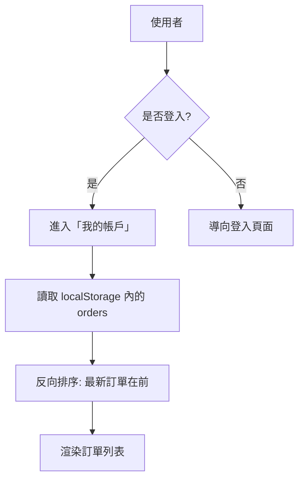

# Workflow — 歷史訂單查詢

使用者可以隨時查看過去在商城完成的所有購買記錄。

## 流程圖

## 核心細節
- **資料庫替代**: 使用 `localStorage` 的 `orders` 陣列。
- **顯示資訊**: 每筆訂單包含編號 (O+時間戳)、總金額、下單時間及當前狀態。
- **空狀態**: 若無訂單, 顯示「暫無訂單記錄」並引導回商城。

## 程式碼實作
- 函式：`index.html` 中的 `renderAccount()`。
